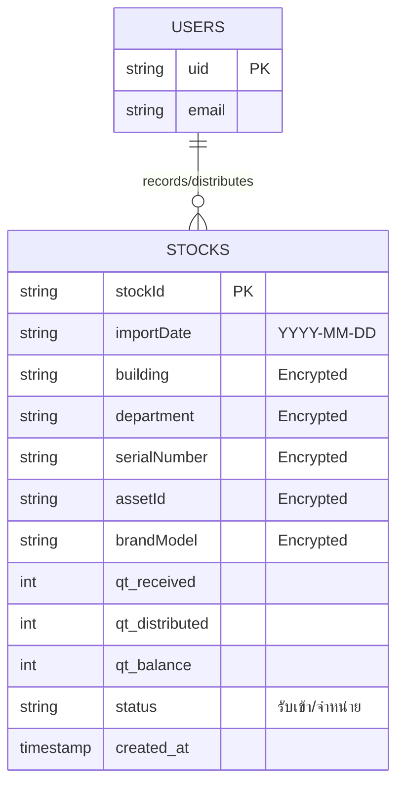

# Stock Management System (ระบบจัดการ Stock พัสดุครุภัณฑ์)

A secure, production-ready Stock Management System built with React, Firebase, and Bootstrap.
hhheee
## Features
- **Authentication**: Secure login with Firebase Auth.
- **Stock Management**:
  - **Incoming**: Add new stock with encrypted details.
  - **Distribution**: Distribute stock and automatically generate Excel reports.
  - **Dashboard**: Real-time overview of stock status.
- **Security**: Client-side AES encryption for sensitive data (Names, Asset IDs, S/N).
- **Localization**: Full Thai User Interface.

## Prerequisites
- Node.js (v14 or higher)
- Firebase Project (Realtime Database & Auth enabled)

## Setup Instructions

1. **Clone/Download the repository**
   ```bash
   cd stock_dbcenter
   npm install
   ```

2. **Configure Environment Variables**
   - Rename `.env.example` to `.env`
   - Fill in your Firebase config keys and choose a strong Encryption Key.
   ```env
   VITE_FIREBASE_API_KEY=...
   VITE_FIREBASE_AUTH_DOMAIN=...
   VITE_FIREBASE_DATABASE_URL=...
   VITE_APP_ENCRYPTION_KEY=your-secret-key
   ```

3. **Firebase Setup**
   - Go to Firebase Console -> Authentication -> Enable **Email/Password**.
   - Go to Realtime Database -> Rules -> Copy content from `database.rules.json`.

4. **Run Locally**
   ```bash
   npm run dev
   ```

## Database Structure & ER Diagram



## Security Note
All sensitive fields (Building, Dept, S/N, AssetID) are encrypted BEFORE being sent to Firebase using AES. You must not lose the `VITE_APP_ENCRYPTION_KEY` or data will be unreadable.
